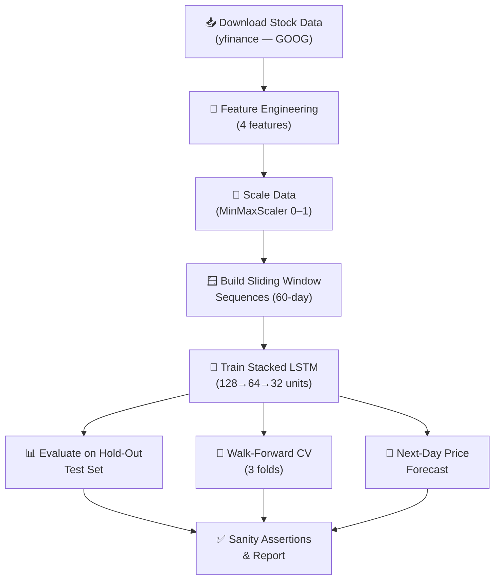

# 🧪 LSTM Smoke Test — Explained

> **File:** `test.py`
> **Purpose:** Validate that the LSTM stock-price prediction pipeline works end-to-end and produces reasonable results before deploying or iterating further.

---

## What Is a "Smoke Test"?

A **smoke test** is a quick sanity check — it answers:

> *"Does the system run without catching fire?"*

It doesn't exhaustively test every edge case. Instead, it confirms:
- Data downloads correctly
- Features are engineered properly
- The model trains without crashing
- Predictions are finite, real numbers
- Error metrics (MAE, RMSE, etc.) are within a sensible range

---

## High-Level Pipeline



---

## Step-by-Step Breakdown

### 1. Configuration (Lines 28–36)

| Parameter | Value | What it means |
|-----------|-------|---------------|
| `TICKER` | `GOOG` | Predicting Google's stock price |
| `TRAIN_START` | Jan 1, 2020 | Training data begins here |
| `TRAIN_END` | Jan 1, 2024 | Training data ends / test data begins |
| `TEST_END` | Jul 1, 2024 | Test period: 6 months of unseen data |
| `WINDOW` | 60 | Model looks at the last 60 trading days to make a prediction |
| `N_FEATURES` | 4 | Number of input features per day |
| `EPOCHS` | 40 | Maximum training iterations |
| `BATCH_SIZE` | 32 | Samples per gradient update |

---

### 2. Feature Engineering (Lines 43–66)

Raw OHLCV data is transformed into **4 meaningful features**:

| # | Feature | Formula | Why it helps |
|---|---------|---------|--------------|
| 1 | **Close** | Raw closing price | The target we're predicting |
| 2 | **Volume** | Raw trading volume | High volume = strong conviction in price moves |
| 3 | **Return (1-day)** | `ln(Close_t / Close_{t-1})` | Log returns reduce non-stationarity — the model sees *relative* changes, not raw price levels |
| 4 | **MA5** | 5-day moving average of Close | Captures short-term trend direction |

> **Note:** The first 5 rows are dropped (`dropna()`) because the moving average and return calculations need prior days to compute.

---

### 3. Scaling (Lines 217–222)

```
MinMaxScaler → scales each feature to [0, 1]
```

- **Fit on training data only** — this prevents data leakage from the test set.
- Test data is transformed using the *same* scaler (same min/max values from training).

> **Important:** Fitting the scaler on the full dataset (train + test) would leak future information into training and produce artificially good results.

---

### 4. Sliding Window Sequences (Lines 73–84)

The model doesn't see individual days — it sees **windows of 60 consecutive days** and predicts the **next day's closing price**.

```
Day 1–60   → predict Day 61's Close
Day 2–61   → predict Day 62's Close
Day 3–62   → predict Day 63's Close
...
```

**Output shapes:**
- `X`: `(num_samples, 60, 4)` — 60 days × 4 features per sample
- `y`: `(num_samples,)` — single Close price target

---

### 5. Model Architecture (Lines 91–125)

A **3-layer stacked LSTM** with regularization:

```
┌─────────────────────────────────────────┐
│  Input: (60 timesteps, 4 features)      │
├─────────────────────────────────────────┤
│  LSTM 128 units (return sequences)      │
│  BatchNormalization                     │
│  Dropout 20%                            │
├─────────────────────────────────────────┤
│  LSTM 64 units (return sequences)       │
│  BatchNormalization                     │
│  Dropout 20%                            │
├─────────────────────────────────────────┤
│  LSTM 32 units (final state only)       │
│  BatchNormalization                     │
│  Dropout 10%                            │
├─────────────────────────────────────────┤
│  Dense 16 (ReLU)                        │
│  Dense 1  (Linear — price output)       │
└─────────────────────────────────────────┘
```

**Key design choices:**

| Technique | Purpose |
|-----------|---------|
| **Stacked LSTMs** (128→64→32) | Each layer extracts increasingly abstract temporal patterns |
| **BatchNormalization** | Stabilizes training; prevents internal covariate shift |
| **Dropout** (10–20%) | Prevents overfitting by randomly zeroing neurons during training |
| **L2 Regularization** (1e-4) | Penalizes large weights to keep the model generalizable |
| **Huber Loss** | More robust than MSE — doesn't overreact to price spikes/outliers |
| **Adam Optimizer** (lr=1e-3) | Adaptive learning rate; fast convergence |

**Training callbacks:**
- **EarlyStopping** (patience=8): Stops training if loss doesn't improve for 8 epochs; restores best weights.
- **ReduceLROnPlateau** (patience=4): Halves the learning rate if loss plateaus for 4 epochs.

---

### 6. Evaluation — Hold-Out Test Set (Lines 253–264)

After training, the model predicts on the **unseen test period** (Jan–Jul 2024).

Predictions are **inverse-transformed** back to real dollar values, then compared with actual prices.

**Metrics reported:**

| Metric | What it measures |
|--------|-----------------|
| **MAE** (Mean Absolute Error) | Average dollar error per prediction — *"On average, predictions are off by $X"* |
| **RMSE** (Root Mean Squared Error) | Like MAE but penalizes large errors more heavily |
| **MAPE** (Mean Absolute % Error) | Error as a percentage of actual price — useful for comparing across stocks |
| **R²** (R-squared) | How much variance the model explains (1.0 = perfect, 0 = no better than guessing the mean) |

---

### 7. Walk-Forward Cross-Validation (Lines 132–192)

> **Tip:** This is the most honest evaluation method for time-series data.

A single train/test split can be misleading. Walk-forward CV uses **3 expanding folds**:

```
Fold 1:  Train [████████░░░░░░░░]  Test [████░░░░░░░░]
Fold 2:  Train [████████████░░░░]  Test [████░░░░]
Fold 3:  Train [████████████████]  Test [████]
```

- Training always starts from the beginning (anchored).
- Each fold trains a **fresh model** — no information leaks between folds.
- The reported **CV MAE** is the average across all 3 folds.

> **Warning:** Unlike regular k-fold CV, you **cannot shuffle** time-series data. Walk-forward preserves temporal ordering.

---

### 8. Next-Day Forecast (Lines 273–278)

Takes the **last 60 days** of available data and predicts **tomorrow's closing price** — this is the practical output of the model.

---

### 9. Sanity Assertions (Lines 280–282)

Two simple checks that will **crash the test** if something went wrong:

```python
assert np.isfinite(mae)            # MAE must be a real number
assert np.isfinite(next_day_price) # Prediction must be a real number
```

If either is `NaN` or `inf`, the model is broken.

---

## Expected Output

When the test passes, you'll see something like:

```
────────────────────────────────────────────────────────────
  LSTM Smoke Test  |  GOOG  |  window=60  features=4
────────────────────────────────────────────────────────────
  Train sequences : 940
  Test  sequences : 65

  Epoch 1/40 ...
  ...

  Walk-forward cross-validation (3 folds):
    Fold 1  |  samples train=180  test=60  |  MAE=$X.XXXX
    Fold 2  |  samples train=360  test=60  |  MAE=$X.XXXX
    Fold 3  |  samples train=540  test=60  |  MAE=$X.XXXX

────────────────────────────────────────────────────────────
  ✅ Smoke test passed
────────────────────────────────────────────────────────────
  Hold-out MAE    : $X.XXXX
  Hold-out RMSE   : $X.XXXX
  Hold-out MAPE   : X.XX%
  Hold-out R²     : 0.XXXX
  Walk-forward MAE: $X.XXXX  (mean over 3 folds)
  Epochs trained  : XX  (early stop at 40 max)
  Next-day price  : $XXX.XX
────────────────────────────────────────────────────────────
```

---

## Summary

| Stage | What Happens |
|-------|-------------|
| **Data** | Downloads ~4 years of GOOG OHLCV data via Yahoo Finance |
| **Features** | Engineers 4 features: Close, Volume, Log Return, 5-day MA |
| **Scaling** | MinMaxScaler fitted on training data only |
| **Sequences** | 60-day sliding windows → (X, y) pairs |
| **Model** | 3-layer LSTM with BatchNorm, Dropout, L2 regularization |
| **Training** | Huber loss, Adam optimizer, early stopping + LR scheduling |
| **Evaluation** | Hold-out metrics (MAE, RMSE, MAPE, R²) + 3-fold walk-forward CV |
| **Forecast** | Predicts next trading day's closing price |
| **Assertions** | Confirms predictions are finite real numbers |

> **Caution:** This is a **smoke test**, not a production trading system. Real-world stock prediction requires much more: external data sources, risk management, transaction costs, regime detection, and continuous retraining.
